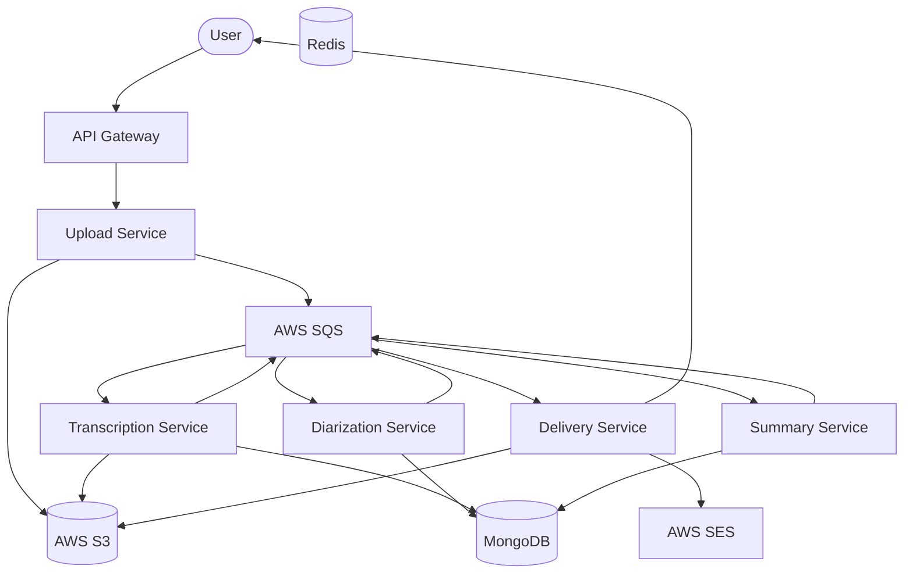

# EchoMeet — AI Meeting Transcription & Summarization Platform

EchoMeet is a production-grade, microservices-based platform for transcribing, diarizing, and summarizing meetings. It's a high-performance clone of services like Otter.ai, built with Node.js, TypeScript, OpenAI's Whisper, and GPT-4.

## 🏗️ Architecture



## 🚀 Features

- **Distributed Pipeline**: Asynchronous processing using SQS for high scalability.
- **AI Transcription**: High-accuracy transcription using OpenAI Whisper.
- **Smart Diarization**: GPT-4 driven speaker labeling based on conversational patterns.
- **Automated Summary**: Action items, decisions, and sentiment extraction via GPT-4.
- **Email Delivery**: Automatic PDF generation and email delivery via AWS SES.
- **Monitoring**: Full Prometheus metrics and Grafana dashboard included.
- **Production-Ready**: Docker, Kubernetes, Rate Limiting, and JWT Auth.

## 🛠️ Tech Stack

- **Languge**: TypeScript
- **Runtime**: Node.js 20 (Alpine)
- **Framework**: Express.js
- **Databases**: MongoDB (Persistence), Redis (Rate Limiting/Caching)
- **Cloud (LocalStack)**: S3, SQS, SES
- **AI**: OpenAI API (Whisper & GPT-4)
- **Infrastructure**: Docker Compose, Kubernetes (HPA, ALB Ingress)

## 📦 Setup & Local Development

### Prerequisites

- Docker & Docker Compose
- OpenAI API Key

### Running Locally

1. **Clone the repo**
2. **Setup environment variables**:
   Create a `.env` file in each service directory (or use a root `.env` for Docker Compose).
3. **Start the stack**:
   ```bash
   export OPENAI_API_KEY=your_key_here
   cd echomeet/infrastructure
   docker-compose up --build
   ```
4. **LocalStack Initialization**:
   The `infrastructure/localstack/init-aws.sh` script automatically creates the S3 buckets and SQS queues on startup.

## 📡 API Documentation

### Auth
- `POST /api/v1/auth/login` - (Implementation in Gateway)

### Upload
- `POST /api/v1/upload/presigned-url` - Get S3 upload URL.
- `POST /api/v1/upload/complete` - Notify upload completion.

### Meetings
- `GET /api/v1/meetings/:id` - Fetch meeting status.
- `GET /api/v1/meetings/:id/download` - Download PDF report.

## 📊 Monitoring

- **Prometheus**: Accessible at `http://localhost:9090`
- **Grafana**: Accessible at `http://localhost:3000` (Default: admin/admin)
- **Metrics**: Each service exposes `/metrics` on its internal port.

## ☸️ Kubernetes Deployment

Manifests are located in `infrastructure/k8s/`.
Apply them using:
```bash
kubectl apply -f infrastructure/k8s/namespaces.yaml
kubectl apply -f infrastructure/k8s/ -R
```

## 📝 License

ISC
